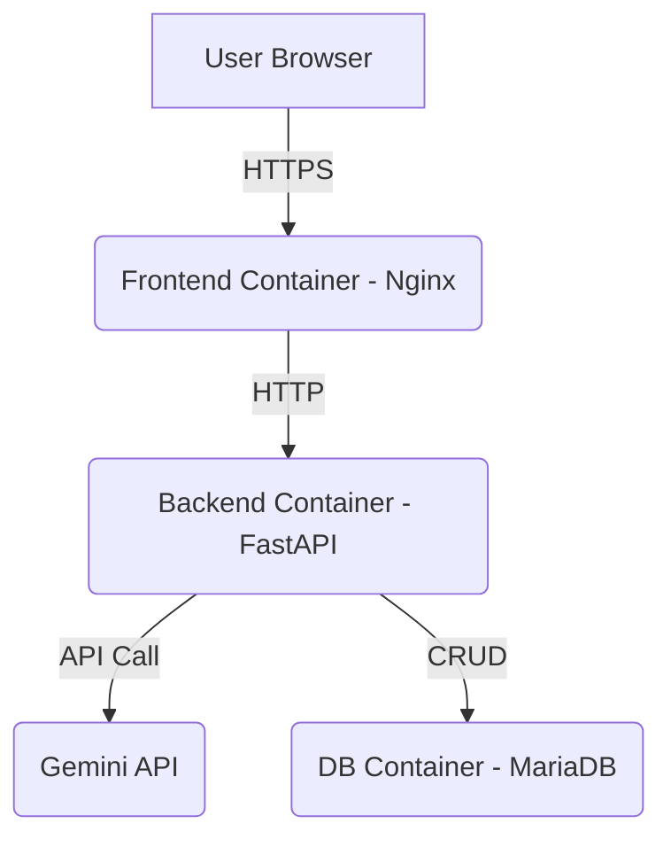

# 設計書

## 1. システム構成



-   **Frontend**: React (TypeScript)で構築されたSPA。Nginxコンテナによって静的ファイルが配信される。
-   **Backend**: FastAPI (Python)で構築されたAPIサーバー。ビジネスロジック、DBとの連携、Gemini APIとの通信を担う。
-   **Database**: MariaDBコンテナ。ユーザー情報や食事記録を永続化する。
-   **Docker**: 上記のサービスを`docker-compose`で一元管理する。

## 2. データベース設計

### 2.1. ER図

```
+-----------------------+       +-------------------------+
| users                 |       | meals                   |
+-----------------------+       +-------------------------+
| id (PK)               |-----<| user_id (FK)            |
| username              |       | id (PK)                 |
| password_hash         |       | meal_type               |
| daily_calorie_limit   |       | image_path              |
| created_at            |       | calories                |
+-----------------------+       | description             |
                                | created_at              |
                                +-------------------------+
```

### 2.2. テーブル定義

#### `users` テーブル

| カラム名              | データ型         | 制約                       | 説明                           |
| --------------------- | ---------------- | -------------------------- | ------------------------------ |
| `id`                  | INT              | PRIMARY KEY, AUTO_INCREMENT| ユーザーID                     |
| `username`            | VARCHAR(255)     | UNIQUE, NOT NULL           | ユーザー名                     |
| `password_hash`       | VARCHAR(255)     | NOT NULL                   | ハッシュ化されたパスワード     |
| `daily_calorie_limit` | INT              | NOT NULL, DEFAULT 2000     | 1日の目標摂取カロリー          |
| `created_at`          | TIMESTAMP        | DEFAULT CURRENT_TIMESTAMP  | 作成日時                       |

#### `meals` テーブル

| カラム名      | データ型                           | 制約                       | 説明                           |
| ------------- | ---------------------------------- | -------------------------- | ------------------------------ |
| `id`          | INT                                | PRIMARY KEY, AUTO_INCREMENT| 食事記録ID                     |
| `user_id`     | INT                                | FOREIGN KEY (users.id)     | ユーザーID                     |
| `meal_type`   | ENUM('breakfast', 'lunch', 'dinner') | NOT NULL                   | 食事のタイミング               |
| `image_path`  | VARCHAR(255)                       | NOT NULL                   | アップロードされた画像のパス   |
| `calories`    | INT                                | NOT NULL                   | 推定カロリー                   |
| `description` | TEXT                               | NULLABLE                   | Gemini APIによる食事内容の説明 |
| `created_at`  | TIMESTAMP                          | DEFAULT CURRENT_TIMESTAMP  | 作成日時                       |

## 3. APIエンドポイント設計

**Base URL**: `/api/v1`

### 3.1. 認証 (`/auth`)

-   `POST /signup`
    -   **説明**: 新規ユーザー登録
    -   **リクエストボディ**: `{ "username": "user", "password": "password" }`
    -   **レスポンス**: `{ "id": 1, "username": "user" }`
-   `POST /login`
    -   **説明**: ログインしてJWTトークンを取得
    -   **リクエストボディ**: `(Form Data) username=user&password=password`
    -   **レスポンス**: `{ "access_token": "...", "token_type": "bearer" }`

### 3.2. ユーザー (`/users`)

-   `GET /users/me`
    -   **説明**: 現在のログインユーザー情報を取得
    -   **認証**: 要JWTトークン
    -   **レスポンス**: `{ "id": 1, "username": "user", "daily_calorie_limit": 2000 }`
-   `PUT /users/me`
    -   **説明**: ユーザー情報（現在はカロリー上限のみ）を更新
    -   **認証**: 要JWTトークン
    -   **リクエストボディ**: `{ "daily_calorie_limit": 1800 }`
    -   **レスポンス**: 更新後のユーザー情報

### 3.3. 食事 (`/meals`)

-   `POST /`
    -   **説明**: 食事の写真をアップロードしてカロリーを記録
    -   **認証**: 要JWTトークン
    -   **リクエストボディ**: `(Form Data) meal_type='lunch' file=...`
    -   **レスポンス**: `{ "id": 1, "meal_type": "lunch", "calories": 500, ... }`
-   `GET /today`
    -   **説明**: 今日の食事記録を全て取得
    -   **認証**: 要JWTトークン
    -   **レスポンス**: `[ { meal1 }, { meal2 }, ... ]`

## 4. ディレクトリ構成案

```
/app_body
├── backend/
│   ├── app/
│   ├── Dockerfile
│   └── requirements.txt
├── frontend/
│   ├── public/
│   ├── src/
│   ├── Dockerfile
│   └── package.json
├── .gitignore
├── docker-compose.yml
├── requirements.md
└── design.md
```
